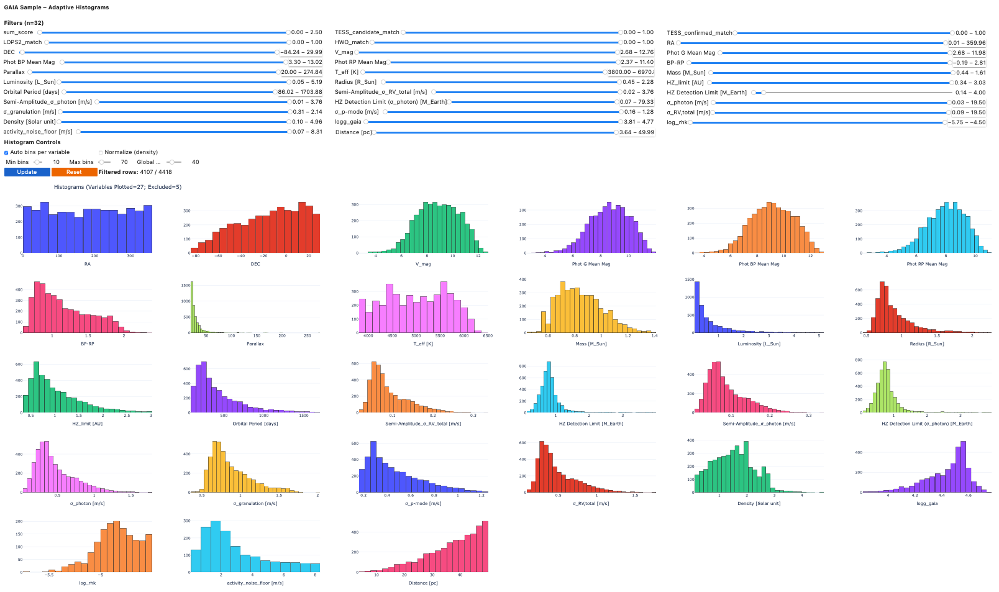

# 2ES Target Selection Pipeline

A professional, modular pipeline for selecting optimal targets for the 2ES (The Second Earth Spectrograph) exoplanet detection mission. This pipeline processes Gaia data, applies stellar filters, calculates habitable zones, and performs crossmatching with external catalogs to identify the best targets for exoplanet detection.

## 🚀 Quick Start

### Prerequisites
- Python 3.8+
- Conda environment with required packages
- Access to Gaia database

### Installation
```bash
# Clone the repository
git clone <repository-url>
cd 2ES_target_selection

# Activate the 2ES conda environment
conda activate 2ES

# Install dependencies (if not already installed)
pip install -r requirements.txt
```

### Running the Pipeline
```bash
cd src
python main_2ES_pipeline.py
```

## 📁 Project Structure

```
2ES_target_selection/
├── src/                           # Main source code
│   ├── core/                      # Core infrastructure
│   │   ├── config.py             # Centralized configuration
│   │   ├── exceptions.py         # Custom exception handling
│   │   └── logging_config.py     # Professional logging
│   ├── data/                      # Data processing modules
│   │   ├── validation/           # Data validation
│   │   └── processing/            # Data processing
│   ├── pipeline/                  # Pipeline architecture
│   │   ├── base_simple.py        # Base pipeline classes
│   │   └── stages/                # Individual pipeline stages
│   │       ├── gaia_acquisition_stage.py
│   │       ├── data_cleaning_stage.py
│   │       ├── data_consolidation_stage.py
│   │       ├── catalog_enrichment_stage.py
│   │       ├── filtering_stage.py
│   │       ├── bright_neighbors_stage.py
│   │       ├── habitable_zone_stage.py
│   │       ├── visualization_stage.py
│   │       ├── ralf_comparison_stage.py
│   │       └── crossmatching_stage.py
│   └── main_2ES_pipeline.py       # Main pipeline script
├── data/                          # Input data files
├── results/                       # Output files
├── figures/                       # Generated plots
├── logs/                          # Pipeline logs
├── archive/                       # Archived original files
└── requirements.txt               # Python dependencies
```

## 🔄 Pipeline Stages

The pipeline consists of 10 modular stages:

1. **Gaia Acquisition** - Queries Gaia DR2/DR3 databases
2. **Data Cleaning** - Removes duplicates and cleans data
3. **Data Consolidation** - Merges DR2/DR3 data and adds identifiers
4. **Catalog Enrichment** - Adds external catalog data (CELESTA, Vizier, R'HK)
5. **Filtering** - Applies stellar parameter filters
6. **Bright Neighbors** - Identifies and filters stars with bright neighbors
7. **Habitable Zone** - Calculates habitable zones and noise models
8. **Visualization** - Creates plots and diagrams
9. **Ralf Comparison** - Compares with Ralf's target list
10. **Crossmatching** - Crossmatches with HWO, PLATO, and TESS catalogs

## ⚙️ Configuration

The pipeline uses a centralized configuration system in `src/core/config.py`:

```python
from core.config import Config

config = Config()
# Access configuration parameters
print(config.stellar_filters.temp_min)
print(config.query_params.target_g_mag_limit)
```

### Key Configuration Parameters

- **Stellar Filters**: Temperature, luminosity, density, logg ranges
- **Query Parameters**: Magnitude limits, parallax thresholds, search radius
- **Noise Parameters**: Instrumental noise, granulation, p-mode fractions
- **Detection Limits**: HZ detection limits in Earth masses

## 📊 Output Files

The pipeline generates several output files in the `results/` directory:

- **`Gaia_homogeneous_target_selection_YYYY.MM.DD_100_granulation.xlsx`** - Main results file
- **`GAIA_TESS_confirmed_matches.xlsx`** - TESS confirmed planet matches
- **`GAIA_TESS_candidate_matches.xlsx`** - TESS candidate matches
- **`stars_without_bright_neighbors.xlsx`** - Filtered star list

## 📈 Generated Plots

The pipeline creates various plots in the `figures/` directory:

- **HR Diagrams** - Hertzsprung-Russell diagrams with detection limits
- **Color-Magnitude Diagrams** - Stellar color vs magnitude plots
- **Density vs logg** - Stellar density analysis
- **RA/Dec Maps** - Sky distribution of targets
- **Crossmatch Comparisons** - Validation against external catalogs

## 🛠️ Development

### Adding New Pipeline Stages

1. Create a new stage class in `src/pipeline/stages/`
2. Inherit from `PipelineStage`
3. Implement the `process()` method
4. Add to the main pipeline in `src/main_2ES_pipeline.py`

```python
from pipeline.base_simple import PipelineStage

class MyNewStage(PipelineStage):
    def process(self, data):
        # Your processing logic here
        return processed_data
```

### Modifying Configuration

Edit `src/core/config.py` to change default parameters:

```python
@dataclass
class StellarFilters:
    temp_min: float = 3800      # Minimum temperature
    temp_max: float = 6500      # Maximum temperature
    # ... other parameters
```


---
## Interactive 2ES Target List Explorer

Explore and analyze the Gaia target list interactively in your browser. You can launch the interactive histogram explorer (powered by Binder and Voilà) using the button below:

[](https://mybinder.org/v2/gh/exoplanetsdk/2ES_target_selection/THE?urlpath=voila/render/notebooks/Interactive_2ES_Targets_Explorer.ipynb)

Alternatively, open the explorer in a standard Jupyter notebook interface [here](https://mybinder.org/v2/gh/exoplanetsdk/2ES_target_selection/THE?urlpath=%2Fdoc%2Ftree%2Fnotebooks%2FInteractive_2ES_Targets_Explorer.ipynb).

*Note: The first launch may take a few minutes to initialize.*



## Radial Velocity precision calculator

The photon-limited RV precision calculations, available in the [Radial Velocity precision calculator](http://www.astro.physik.uni-goettingen.de/research/rvprecision/) (Reiners & Zechmeister, 2020), have been automated in the `rv_prec.py` script. This automation eliminates the need for the online calculator, significantly speeding up the pipeline and allowing it to scale efficiently for a large number of stars.


**Example Usage**

To compute the photon-limited Radial Velocity (RV) precision for a star (e.g., Teff = 5000 K, Vmag = 8, 10-minute exposure by default), simply run:

```python
from rv_prec import calculate_rv_precision
result, custom_rv_precision = calculate_rv_precision(5000, 8)
custom_rv_precision
```
returning an RV precision of 0.3886429800604213 m/s. The telescope parameters are tailored for 2ES and are predefined in the `get_manual_values` function. 


## Recent Major Maintenance

### **2025-09-25: Complete Repository Restructuring & Optimization**

- **2025-09**: Complete repository restructuring & optimization, now a modular 10-stage pipeline (`core/`, `data/`, `pipeline/`), with centralized config, logging, and data validation. Implemented [TACS](https://github.com/MichaelCretignier/TACS) from Michael Cretignier to calculate stellar visibility throughout the year. 


- **2025-08-18**: Included p-mode and granulation RV noise for calculating the detection limit; integrated log R'HK activity metric for estimating stellar noise floor; introduced score for cross-matching HWO/TESS/PLATO targets; enabled interactive histograms.

- **2025-07-22**: Due to changes in SIMBAD query, the Gaia data release (e.g., Gaia DR3) needs to be specified to ensure stars are retrieved correctly and stellar identifiers (e.g. HD, GJ, HIP) are extracted. Updated column name handling to accommodate SIMBAD's revised naming conventions for stellar types. Updated the crossmatching logic. 

## Troubleshooting: SIMBAD Connection Issues

Occasionally, the pipeline may be interrupted by an error similar to the following:

```
pyvo.dal.exceptions.DALServiceError: Unable to access the capabilities endpoint at:
- https://simbad.cds.unistra.fr/simbad/sim-tap/capabilities: Connection failed (Possible causes: incorrect URL, DNS issue, or service is down)

This could mean:
1. The service URL is incorrect
2. The service is temporarily unavailable
3. The service doesn't support this protocol
4. If a 503 was encountered, retry after the suggested delay.
```

This issue is related to the SIMBAD service connection and is not caused by the pipeline code itself. If you encounter this error, it is likely due to a temporary outage or network issue with the SIMBAD service. If this happens, simply wait and try running the code again at a later time. 